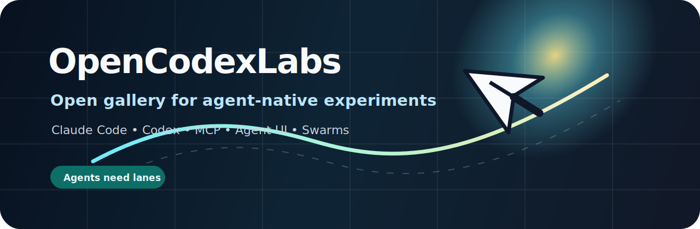

  

<h1 align="center">OpenClaudex</h1>

  <strong>Open-source background computer use for Claude and Codex on macOS.</strong>

  Claude Code • Codex • MCP • macOS • Native App Control

  
  
  
  
  
  

## Projects

### [open-claudex-computer-use](https://github.com/OpenClaudex/open-claudex-computer-use)

Swift MCP server for native macOS computer use.

It lets Claude Code, Codex, and MCP agents inspect and operate real Mac apps with Accessibility, screenshots, post-action state, and an app-aware virtual cursor.

## What It Is

OpenClaudex builds open tools for native app control on macOS, focused on background computer use, accessibility-driven interaction, and model-friendly control surfaces.

## Why

- Native macOS app interaction
- Built for Claude and Codex workflows
- Open-source alternative to closed computer-use stacks
- Background execution without stealing the user's mouse and keyboard

## Recent Demo

| Native Apps | Background Work | Feishu / Lark |
|---|---|---|
|  |  |  |

## What We Care About

- Agents should cooperate with human workflows, not hijack them.
- Tool execution should be visible, recoverable, and inspectable.
- MCP execution layers should be open, small, and reusable.

## Follow The Work

- Star the project: [open-claudex-computer-use](https://github.com/OpenClaudex/open-claudex-computer-use)
- Report issues or request features: [Issues](https://github.com/OpenClaudex/open-claudex-computer-use/issues)
- Follow the org for more Claude, Codex, and MCP computer-use infrastructure.
